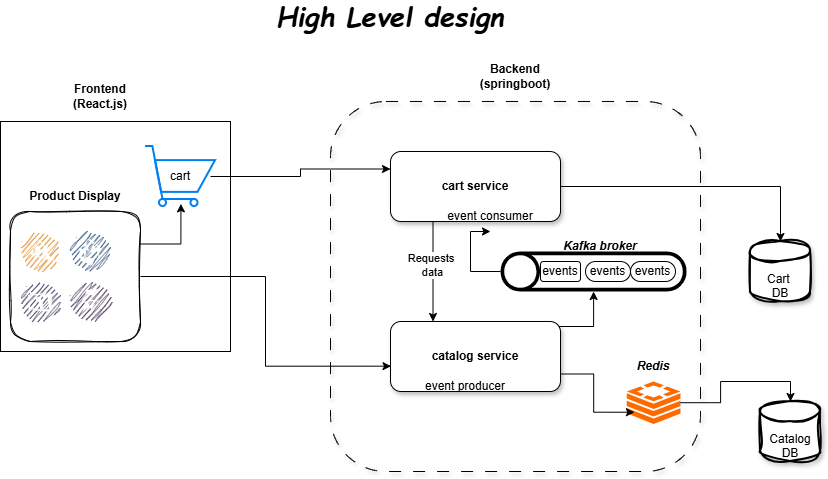

# Ecommerce Fullstack

## High Level Architecture (HLD)



## Project Overview
Ecommerce Fullstack is a microservices-based e-commerce application built with React.js for the frontend and Spring Boot for the backend. It currently includes **Catalog Service** and **Cart Service**, providing a seamless shopping experience with real-time updates using Kafka and optimized performance using Redis caching.

## Tech Stack
- **Frontend:** React.js  
- **Backend:** Spring Boot (Java)  
- **Database:** MySQL  
- **Event Streaming:** Apache Kafka  
- **Caching:** Redis  
- **Build & Dependency Management:** Maven  

## Microservices
- **Catalog Service:** Fetches and exposes product details. Publishes product update events via Kafka.  
- **Cart Service:** Handles cart operations. Consumes Kafka events to keep cart data consistent when product details change.  

## Key Features
- Display products from Catalog Service in the frontend.  
- Add products to cart and store cart data in Cart Service database.  
- Event-driven updates: Product changes automatically reflect in the cart via Kafka.  
- Redis caching for frequently fetched product data to improve performance.  

## Future Enhancements
- Integrate API Gateway for routing and service management.  
- Expand microservices to include order management and user authentication.  

## Setup Instructions
1. **Backend**
   - Navigate to each service folder (`catalog` and `cart`).  
   - Configure `application.properties` with MySQL, Redis, and Kafka settings.  
   - Run:  
     ```bash
     mvn clean install
     mvn spring-boot:run
     ```
2. **Frontend**
   - Navigate to frontend folder.  
   - Install dependencies:  
     ```bash
     npm install
     ```
   - Start development server:  
     ```bash
     npm start
     ```
3. **Kafka**
   - Start Kafka broker on default port `9092`.  
   - Ensure topics match `catalog-events`.  
4. **Redis**
   - Run Redis server on default port `6379`.  

## Usage
- Browse products via frontend.  
- Add products to cart; cart service stores data in its database.  
- Any update to product details in Catalog Service automatically updates cart items via Kafka events.  
- Frequently accessed products are served from Redis cache for faster response.  

## Contact
For questions or feedback, reach out to **Vinith**: [vinithpoojary1303@gmail.com](mailto:vinithpoojary1303@gmail.com)
