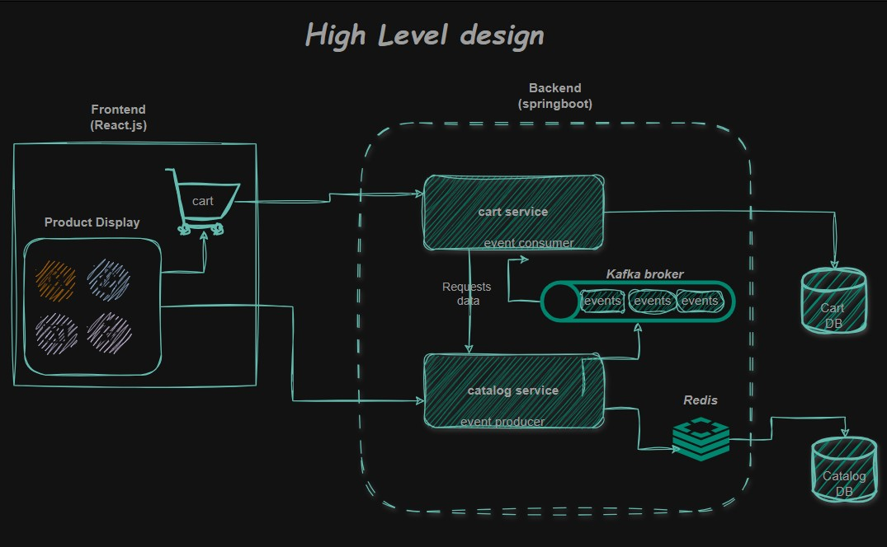

# 🛒 Ecommerce Fullstack

## 🏗 High Level Architecture (HLD)



---

## 🚀 Project Overview

Ecommerce Fullstack is a microservices-based e-commerce application built with **React.js (Frontend)** and **Spring Boot (Backend)**.

The system follows **Event-Driven Architecture (EDA)** using Kafka and implements the **Database-per-Service** pattern.

Currently implemented services:

- **Catalog Service**
- **Cart Service**

The system ensures real-time cart updates when product details change, without tight service coupling.

---

## 🧠 Architecture Highlights

- Microservices architecture
- Database per service pattern
- Event-Driven Architecture using Kafka
- Eventually consistent data model
- Redis caching for performance optimization
- Dockerized infrastructure with Nginx reverse proxy

---

## 🧩 Microservices

### 📦 Catalog Service

- Exposes product APIs
- Stores product data in MySQL
- Publishes product update events to Kafka (`catalog.events`)
- Uses Redis caching for frequently accessed products

### 🛍 Cart Service

- Handles add/remove cart operations
- Maintains its own MySQL database
- Consumes Kafka events from Catalog Service
- Automatically updates cart items when product details change
- Does not poll Catalog (asynchronous design)

---

## ⚙️ Tech Stack

- **Frontend:** React.js
- **Backend:** Spring Boot (Java)
- **Database:** MySQL
- **Event Streaming:** Apache Kafka
- **Caching:** Redis
- **Reverse Proxy:** Nginx
- **Containerization:** Docker & Docker Compose
- **Build Tool:** Maven

---

## 🔄 Event Flow Example

1. Product price is updated in Catalog Service.
2. Catalog publishes an `ITEM_UPDATED` event to Kafka.
3. Cart Service consumes the event.
4. Cart database updates corresponding product data.
5. Frontend reflects updated cart information automatically.

This removes tight REST dependency between services.

---

## 🐳 Running with Docker (Recommended)

From the project root:

```bash
docker-compose up --build
```

### Services

- Catalog → http://localhost:2001
- Cart → http://localhost:2002
- Nginx → http://localhost
- Kafka → 9092
- Redis → 6379

---

## 🛠 Setup Instructions (Manual Run)

### 1️⃣ Backend

- Navigate to each service folder (`catalog` and `cart`)
- Configure `application.properties` for:
  - MySQL
  - Kafka
  - Redis

Run:

```bash
mvn clean install
mvn spring-boot:run
```

---

### 2️⃣ Frontend

Navigate to frontend folder:

```bash
npm install
npm start
```

---

### 3️⃣ Kafka

- Start Kafka broker on default port `9092`
- Ensure topic name matches:
  ```
  catalog.events
  ```

---

### 4️⃣ Redis

Run Redis server on default port:

```
6379
```

---

## ✨ Key Features

- Product listing from Catalog Service
- Add to cart functionality
- Event-driven synchronization between services
- Redis caching for optimized performance
- Dockerized environment for easy setup

---

## 🔮 Future Enhancements

- API Gateway integration
- Order Service
- User Authentication Service
- Saga pattern for distributed transactions
- Centralized configuration management
- CI/CD pipeline

---

## 📬 Contact

**Vinith**  
📧 vinithpoojary1303@gmail.com
